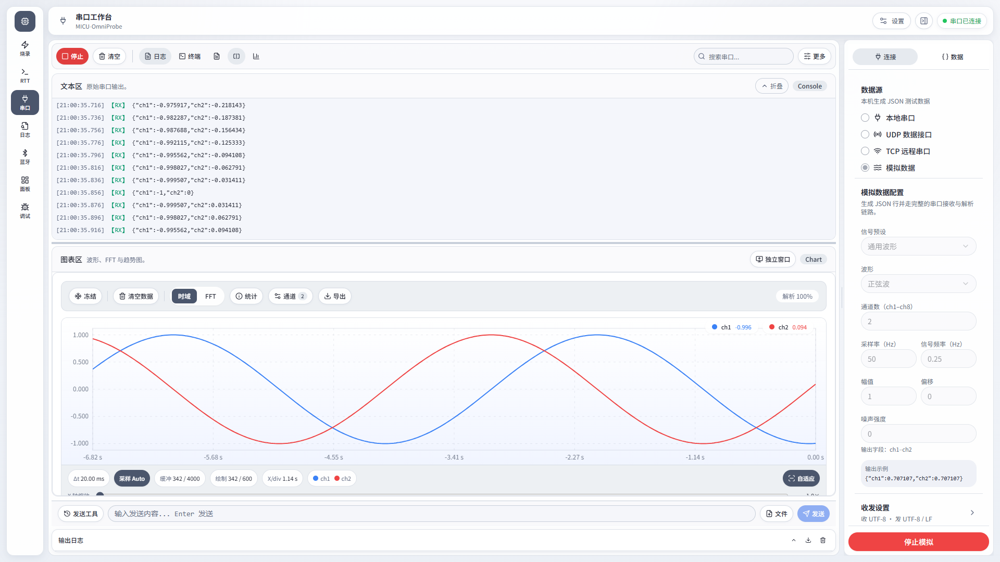
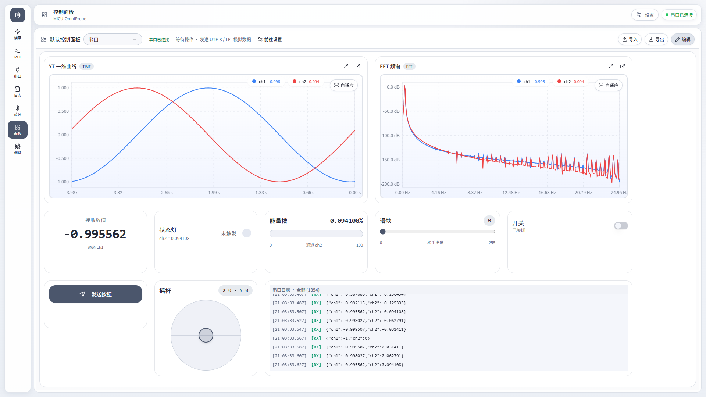
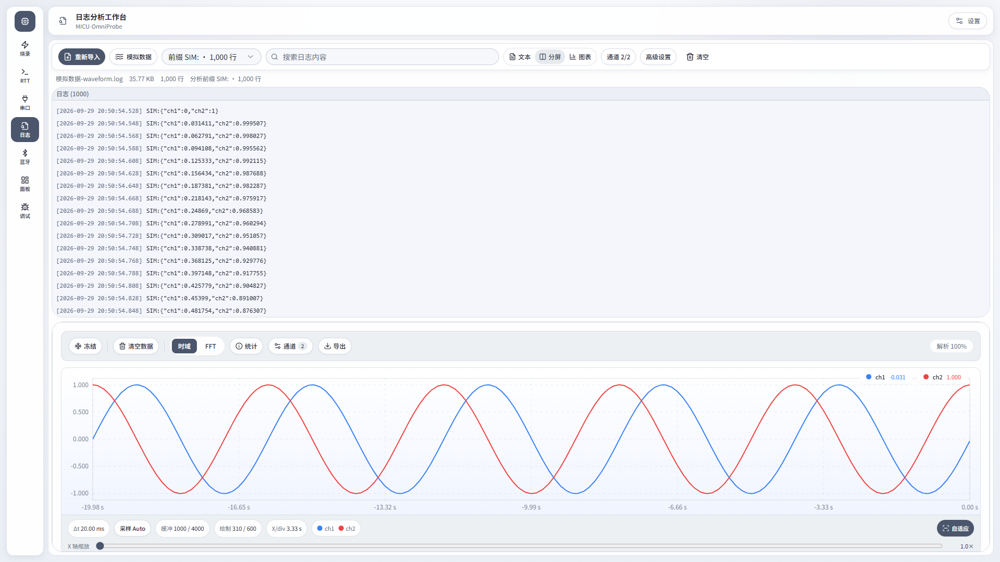
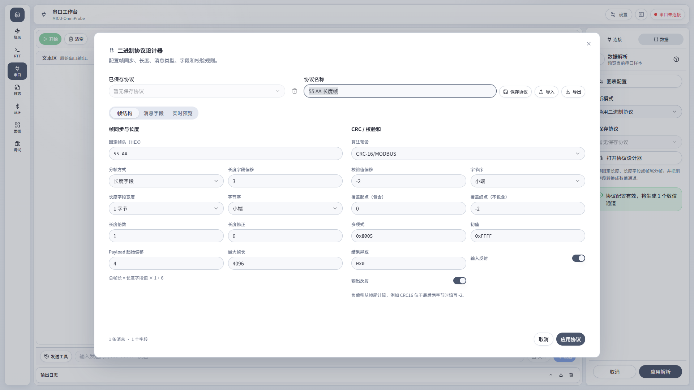
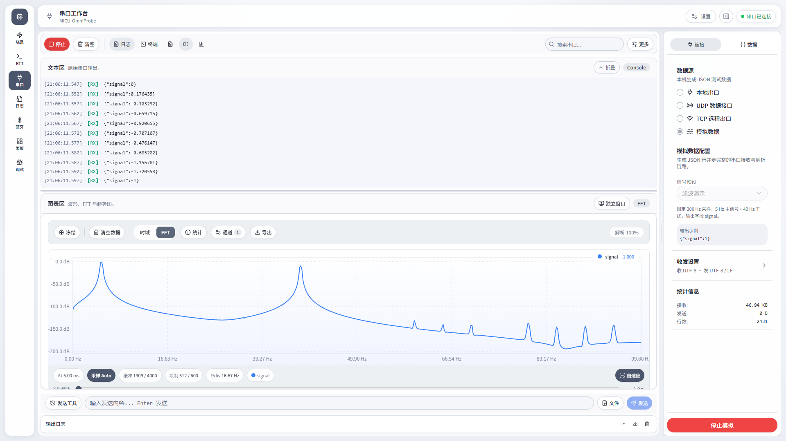
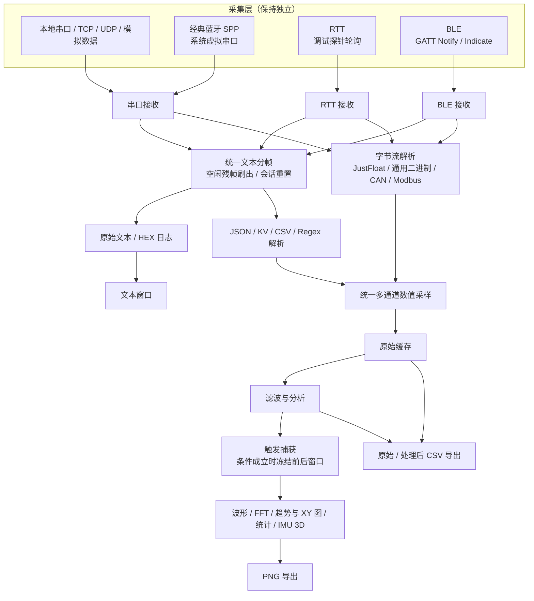

<p align="center">
  
</p>

<p align="center">
  
</p>

<h1 align="center">MICU-OmniProbe</h1>

<p align="center">
  面向嵌入式开发者的一体化桌面调试与分析工作台：烧录、源码调试、RTT、串口、蓝牙和离线日志分析，一个应用完成。
</p>

<p align="center">
  
  
  
</p>

<p align="center">
  <a href="https://github.com/zuoliangyu/MICU-OmniProbe/releases/latest"><strong>下载最新版</strong></a>
  · <a href="https://zuoliangyu.github.io/MICU-OmniProbe/#/QUICK_START">快速入门</a>
  · <a href="https://zuoliangyu.github.io/MICU-OmniProbe/">用户文档</a>
  · <a href="CHANGELOG.md">更新日志</a>
</p>

<p align="center">
  
</p>

## 这是什么

MICU-OmniProbe 把嵌入式开发中经常分散在多个软件里的工作流放进同一个桌面应用。你可以连接调试探针烧录和调试固件，使用 RTT、串口或 BLE 查看实时数据，也可以导入离线日志进行搜索和图表分析。

它适合这些场景：

| 你的任务               | 使用的工作台 | 主要能力                                                   |
| ---------------------- | ------------ | ---------------------------------------------------------- |
| 给 MCU 下载固件        | 烧录         | ELF / HEX / BIN 等格式，擦除、烧录、校验、读取             |
| 查看高速调试输出       | RTT          | 多通道日志与下行发送、搜索、颜色标记、波形和 FFT           |
| 调试 CLI 或串口协议    | 串口         | 串口/TCP/UDP、通用二进制、CAN/SLCAN、Modbus、终端与图表    |
| 分析已有日志文件       | 日志         | 流式导入大日志、搜索、时间戳识别和数值图表                 |
| 组合设备操作与数据显示 | 控制面板     | 独立画布，可选择串口或 RTT 数据来源                        |
| 调试无线设备           | 蓝牙         | BLE 扫描、GATT、Notify / Write、NUS 自动识别、经典蓝牙 SPP |
| 定位 Cortex-M 程序问题 | 调试         | 源码、寄存器、内存、Watch、调用栈和断点                    |

## 界面预览

<table>
  <tr>
    <td width="50%"></td>
    <td width="50%"></td>
  </tr>
  <tr>
    <td align="center"><b>控制面板</b>：自由画布组合发送控件与实时图表</td>
    <td align="center"><b>日志分析</b>：流式导入大日志，按前缀提取数值绘图</td>
  </tr>
  <tr>
    <td width="50%"></td>
    <td width="50%"></td>
  </tr>
  <tr>
    <td align="center"><b>二进制协议设计器</b>：可视化配置帧同步、字段与 CRC</td>
    <td align="center"><b>FFT 频谱</b>：内置滤波演示，一眼看出 5 Hz 信号与 40 Hz 干扰</td>
  </tr>
</table>

> 截图均使用应用内置的“模拟数据”生成，无需连接硬件即可复现。

## 3.1.1 更新重点

3.1.1 补齐 RTT 的固件接入引导：

- **上手有引导**：RTT 文本区没有数据时直接告诉你固件要准备什么，一键打开接入指南
- **源文件离线导出**：软件内置 SEGGER RTT 的 4 个源文件，选好固件工程目录即可导出，无需联网下载
- **指南更完整**：补充上位机操作步骤、控制块查找方式的选择和下行通道读取示例

## 3.1.0 更新重点

3.1.0 重点增强 RTT，并升级探针支持：

- **RTT 双向通信**：可向目标的下行通道发送文本或 HEX，固件用 `SEGGER_RTT_Read` 读取命令
- **控制块定位更快**：支持从 ELF / AXF 的 `_SEGGER_RTT` 符号、指定地址或地址范围定位，不必整片扫描 RAM
- **烧录不用停 RTT**：烧录、擦除期间自动暂停读取，完成后重新查找控制块继续接收，固件地址变化也能恢复
- **更稳的采集**：目标复位或启动较慢时按设定时长持续重连；"暂停显示"不再丢数据；启动过程可取消
- **少一次连接**：已在烧录工作台连接设备时，RTT 可直接复用该连接
- **探针升级**：probe-rs 升级至 0.32，新增 Windows J-Link 官方运行库接入（待实机验收），探针插拔自动刷新

## 3.0.1 更新重点

3.0.1 是一次界面打磨更新：

- **出错不白屏**：某个工作台或配置检查器出错时只影响该区域，并可一键重新加载
- **更易读**：提升最小字号和说明文字对比度，禁用按钮一眼可辨
- **烧录更直观**：顶部固件卡片显示文件名、大小与烧录进度，支持点击选择或拖入窗口
- **操作更统一**：各工作台的"文本 / 分屏 / 图表"切换外观一致；调试状态与 ELF 信息移到顶栏
- **提示更明确**：连接按钮不可用时直接说明缺少哪一步；控制面板组件库带有专属图标

## 3.0.0 更新重点

3.0.0 是一次全面的稳定性与体验升级，重点在“长时间、高速率采集下依然流畅可靠”：

- **更流畅**：高速数据流下不再整页重渲染，首屏加载体积减少约 22%，设置中心、协议设计器等对话框按需加载
- **更可靠**：串口 / RTT 快速启停不再出现两路读取；烧录、连接等耗时操作不再卡住界面或其他数据流
- **更安全**：异常 Pack 不会再导致崩溃；应用只能访问你选择的背景图片；AI 桥接拒绝网页跨协议写入
- **调试更准确**：“单步跳过”真正跨过函数调用，“单步跳出”超时后自动暂停；自定义地址烧录 BIN 后校验结果正确
- **蓝牙增强**：设备掉线自动更新状态，停止扫描即时生效，发送支持 GBK 编码
- **界面打磨**：修复对话框关闭按钮错位与半透明、图表图例遮挡；烧录主操作显示文字，连接按钮统一固定在侧栏底部
- **串口提示**：收不到数据但其他串口助手正常时，“高级设置”会直接提示开启 DTR（树莓派 Pico 等 USB 虚拟串口常见）

完整变化见 [CHANGELOG.md](CHANGELOG.md)。

当前界面采用统一的 IDE 式布局：

- 左侧模式轨道切换烧录、RTT、串口、日志、控制面板、蓝牙和调试工作台
- 顶部命令栏显示当前模式、目标芯片、探针和连接状态（调试工作台显示会话状态与已加载的 ELF）
- 中央工作区专注当前任务，低频操作统一收进“更多”
- 右侧配置检查器负责连接和参数设置，可折叠、拖动宽度
- 底部日志默认折叠，需要排查连接、解析或烧录问题时再展开
- 工作台会按实际窗口宽度调整工具栏、检查器、图表和 IMU 布局

RTT、串口和 BLE 图表可以分别弹出为独立窗口。控制面板使用独立的主工作台，可选择串口或 RTT 数据来源；BLE 面板来源暂未实现。

## 下载与安装

前往 [GitHub Releases](https://github.com/zuoliangyu/MICU-OmniProbe/releases/latest)，选择适合当前系统的安装包。项目发布流程提供 Windows、Linux x64 和 macOS Universal 构建。

应用启动后会自动检查更新，也可以直接在设置中心顶部的“应用信息”中手动检查。

### Linux USB 权限

Linux 用户如果无法访问 CMSIS-DAP 探针，可以安装仓库提供的 udev 规则：

```bash
sudo ./install-udev-rules.sh
```

安装后重新插拔探针。如果只使用 TCP、UDP 或 BLE，可以跳过这一步。

## 快速开始

应用中的七个工作台遵循相同操作逻辑：

1. 从左侧选择工作台。
2. 在右侧配置检查器选择设备、数据源或目标参数。
3. 在中央工作区开始连接、接收、烧录或调试。
4. 需要更多显示、分析和导出能力时打开工具栏“更多”。
5. 出现问题时展开底部日志查看原因。

### 烧录固件

1. 连接 CMSIS-DAP 探针。
2. 在右侧选择探针和目标芯片；找不到芯片时导入厂商 CMSIS-Pack。
3. 打开或拖入 ELF、HEX、BIN、AXF、OUT、IHEX 固件。
4. 连接目标设备，然后点击“烧录”。

### 使用 RTT

1. 在右侧选择探针和目标芯片。
2. 点击“连接 RTT”，再点击“启动”；已在烧录工作台连接设备时可直接启动。
3. 在文本、分屏或图表视图中观察数据；固件有下行通道时可在文本区下方向目标发送数据。
4. 需要时点击启动按钮旁的扫描模式按钮，改用 ELF 符号、指定地址或地址范围定位控制块。
5. 从“更多”使用智能启用、波形、FFT、图表配置、导出和 RTT 接入指南。

目标固件需要集成 SEGGER RTT；仓库中的 [`RTTBSP/`](RTTBSP/) 和 [`examples/gd32-rtt/`](examples/gd32-rtt/) 提供可直接参考的文件与示例。

### 使用串口、TCP 或 UDP

1. 在右侧选择本地串口、TCP 客户端或 UDP 数据接口。
2. 配置连接参数并点击“连接”，然后开始接收。
3. “日志”适合持续观察和筛选，“终端”适合 CLI / shell 式交互。
4. 数值流可以直接进入分屏、波形或 FFT；发送栏支持历史、换行、HEX 和文件发送。
5. 设备使用自定义二进制帧时，在数据解析中选择“通用二进制协议”，从协议库载入或打开设计器配置。
6. 没有硬件时可选择“模拟数据”，生成通用波形、XY 轨迹或 IMU 数据验证完整流程。
7. 需要集中操作设备时进入左侧“面板”，选择串口数据来源，再把常用命令和数据显示组件自由排布在画布上。

### 分析离线日志

1. 从左侧选择“日志”，点击“导入日志”。
2. 选择 UTF-8 编码的 `.log` 或 `.txt` 文件；大文件会分批读取。
3. 搜索日志正文，或切换到分屏、图表视图。
4. 需要提取数值曲线时打开“解析配置”，选择与日志内容匹配的解析方式。

支持的时间戳格式和操作说明见 [日志分析使用指南](https://zuoliangyu.github.io/MICU-OmniProbe/#/LOG_ANALYSIS_GUIDE)。

### 使用 BLE 或经典蓝牙 SPP

BLE：

1. 扫描并连接目标设备。
2. 选择 Notify 和 Write 特征值；Nordic UART Service 通常会自动识别。
3. 点击“开始接收”，随后可查看文本、波形或 FFT，并从底部发送数据。

经典蓝牙 SPP：先在系统蓝牙设置完成配对，再选择应用中的“经典蓝牙 SPP”。系统生成的虚拟串口会交给串口工作台继续使用。

### 源码级调试

1. 选择探针、目标芯片和带调试信息的 ELF 文件。
2. Attach 到目标设备。
3. 使用源码、寄存器、内存、Locals、Watch、调用栈和断点面板定位问题。
4. 面板支持停靠、浮动、合并标签和一键恢复默认布局。

更完整的操作步骤请阅读 [快速入门指南](https://zuoliangyu.github.io/MICU-OmniProbe/#/QUICK_START)。

## 实时数据与图表

RTT、串口和 BLE 共用同一套数值解析与图表工作流：

- 单个数值：实时波形
- CSV：多通道曲线
- JSON / KV：按字段生成通道
- XY 数据：XY 散点图
- 数据帧前缀：混合日志中只解析带指定前缀的文本行
- JustFloat / VOFA RawData：二进制浮点流，串口、RTT 与蓝牙均可使用
- 通用二进制协议：自定义帧头、长度、消息类型、字段与 CRC，串口、RTT 与蓝牙均可使用
- CAN / SLCAN：经典 CAN 与 CAN FD、DBC 信号、节点映射、帧收发和总线负载分析
- 时域 / FFT：时域和频域切换，时域波形可选择直线或平滑曲线连接

### 实时数据流向



三种实时来源在连接和采集阶段保持独立，进入数值解析后共用同一套数据结构、滤波和图表组件。每路文本数据都会保留未完成帧；短暂空闲、停止或断开时会刷出剩余内容并重置会话，避免无换行数据不显示或重连后串帧。BLE 会保留每个 Notify 数据块的接收时间，经典蓝牙 SPP 则完整复用串口链路。

图表工作台支持字段选择、通道改名、单位和颜色、缓冲区上限、可视点数、采样率、CSV / PNG 导出以及独立窗口。波形底部控制栏统一显示采样间隔、缓冲/绘制点数、每格时间或频率、通道和滤波状态，并提供与 `Shift + 滚轮`作用相同的 X 轴缩放条；采样率与视图范围可一键恢复自动。串口的数据解析统一放在右侧“数据”页，图表工具栏集中提供冻结、清空、时域/FFT、统计、通道和导出；冻结期间后台仍会继续解析并缓存数据。

串口右侧“数据”页支持图形化级联低通、高通和带通滤波，可预览频率响应并导出 JSON 参数；也可以粘贴 MATLAB 生成的 FIR 系数或 IIR 的 SOS/ScaleValues。可在串口工作台右侧“连接”页选择“模拟数据 → 滤波演示”，用内置的 5 Hz 主信号和 40 Hz 干扰直接观察时域、FFT 和统计结果。原始日志、CSV 和 AI 数据不会被覆盖。详见 [数据滤波与 MATLAB 参数](https://zuoliangyu.github.io/MICU-OmniProbe/#/MATLAB_FILTER_GUIDE)。

## 控制面板与模拟数据

控制面板是独立工作台，适合把设备调试命令、状态和实时曲线组合成专用操作台：

- 发送组件：按钮、开关、滑块、参数输入、参数微调、摇杆和命令序列
- 显示组件：接收数值、状态灯、能量槽、串口日志、YT 波形、FFT、XY 曲线和 IMU 3D 姿态
- 画布采用完全自由布局，可任意拖动和连续缩放，支持精确坐标、自动保存以及 JSON 导入导出
- 控制面板直接使用完整画布；编辑模式的组件属性面板可浮动、拖动和收起
- 来源设置通过弹窗复用现有串口或 RTT 配置，不会维护第二套连接参数
- 数据来源可选择串口或 RTT；RTT 为只读来源，BLE 暂未实现
- YT 与 FFT 曲线支持一键自适应；串口日志可自定义年月日、时分秒和毫秒等时间戳格式
- 所有控制面板组件与数据解析格式均提供输入示例、数据流说明和在线详细文档入口
- IMU 组件支持欧拉角直驱和六轴互补融合，可执行姿态归零与静止零偏校准

串口模拟数据源可生成正弦、方波、三角波、锯齿波、噪声、固定值、圆形或李萨如 XY 轨迹，以及三轴/六轴 IMU 数据。模拟数据与真实串口共用日志、解析、图表和控制面板链路，便于在没有设备时搭建和验证界面。

串口还可以启动本机 AI 数据桥接，把当前图表解析结果以标准批量样本提供给本地客户端。默认只读，写操作需要显式授权。详见 [AI 数据桥接与可视化调参指南](https://zuoliangyu.github.io/MICU-OmniProbe/#/AI_TUNING_GUIDE)。

## 设备与格式支持

### 调试探针

- 主要验证：CMSIS-DAP / DAPLINK，支持 DAPv1 HID 与 DAPv2 WinUSB
- 调试接口：SWD / JTAG
- probe-rs 支持的 J-Link、ST-Link 等探针理论上可用，但并非所有型号都经过验证
- Windows J-Link 新增官方运行库接入（Cortex-M / SWD，待实机验证），自动识别并复用现有驱动；安装要求和当前限制见[快速入门](docs/QUICK_START.md#windows-上使用-j-link)

### 目标芯片

- 直接使用 probe-rs 内置芯片定义
- 通过 Keil CMSIS-Pack 扩展芯片和 Flash 算法
- 覆盖 STM32、GD32、CW32、Nordic、RP2040、部分 ESP32 等系列；实际支持范围以当前 probe-rs 和已导入 Pack 为准

### 数据与文件

- 固件：ELF、HEX、BIN、AXF、OUT、IHEX
- 离线日志：UTF-8 编码的 LOG、TXT
- 串口数据源：本地串口、TCP、双向 UDP、模拟数据
- 串口文本收发：UTF-8、ASCII、GBK、文本 / HEX、ANSI 颜色
- 图表解析：单值、CSV、JSON、KV、XY、JustFloat、通用二进制、CAN / SLCAN、Modbus

## 用户文档

| 文档                                                                                   | 适合解决的问题                           |
| -------------------------------------------------------------------------------------- | ---------------------------------------- |
| [快速入门](https://zuoliangyu.github.io/MICU-OmniProbe/#/QUICK_START)                | 第一次打开应用，了解界面和基本流程       |
| [RTT 用户手册](https://zuoliangyu.github.io/MICU-OmniProbe/#/RTT_USER_MANUAL)        | RTT 接入、连接、通道和常见问题           |
| [图表与 FFT](https://zuoliangyu.github.io/MICU-OmniProbe/#/RTT_CHART_GUIDE)          | 数值格式、波形、FFT、字段和性能参数      |
| [XY 散点图](https://zuoliangyu.github.io/MICU-OmniProbe/#/RTT_XY_SCATTER_GUIDE)      | 绘制真正的 XY 数据和参数曲线             |
| [串口终端](https://zuoliangyu.github.io/MICU-OmniProbe/#/SERIAL_TERMINAL_GUIDE)      | 数据源、日志、终端、文件发送和波形       |
| [日志分析](https://zuoliangyu.github.io/MICU-OmniProbe/#/LOG_ANALYSIS_GUIDE)         | 导入大日志、搜索、时间戳和数值图表       |
| [蓝牙使用手册](https://zuoliangyu.github.io/MICU-OmniProbe/#/BLUETOOTH_USER_MANUAL)  | BLE、NUS、GATT、Notify / Write 和 SPP    |
| [设置中心](https://zuoliangyu.github.io/MICU-OmniProbe/#/SETTINGS_GUIDE)             | 主题、背景、默认工作台和日志偏好         |
| [AI 数据桥接](https://zuoliangyu.github.io/MICU-OmniProbe/#/AI_TUNING_GUIDE)         | 将串口数值流交给本地 AI 客户端分析和调参 |
| [触发捕获](https://zuoliangyu.github.io/MICU-OmniProbe/#/TRIGGER_CAPTURE_GUIDE)      | 抓瞬时现象：条件成立时冻结前后数据       |
| [会话录制与回放](https://zuoliangyu.github.io/MICU-OmniProbe/#/SESSION_RECORD_GUIDE) | 录下原始数据，换配置反复重放分析         |
| [无线串口透传](https://zuoliangyu.github.io/MICU-OmniProbe/#/WIRELESS_SERIAL_GUIDE)  | Zigbee / LoRa / 蓝牙透传模块接入         |

全部用户文档见 [在线用户文档](https://zuoliangyu.github.io/MICU-OmniProbe/)。

## 已知限制

- BLE 当前仅支持 Central 角色，不支持在应用内完成 PIN 配对绑定或自定义 MTU
- 经典蓝牙 SPP 依赖系统创建虚拟串口，必须先在系统设置中配对
- macOS 首次扫描 BLE 时需要授予系统蓝牙权限
- RTT 默认在目标运行时后台读取；开启“读取时暂停目标”后每次读取都会短暂停止内核，不适合对时序极端敏感的场景
- ESP32 系列需要特殊烧录流程，当前支持范围有限
- 大数据量图表建议合理设置缓冲区和可视点数

## 开发与构建

普通用户不需要安装开发环境。参与开发时需要 Node.js 20、pnpm 9 和 Rust stable：

```bash
pnpm install
pnpm tauri dev
```

Windows 也可以直接运行：

```powershell
.\dev.ps1
```

提交前检查：

```powershell
.\check.ps1
```

构建安装包：

```powershell
.\build.ps1
```

详细项目约束见 [`AGENTS.md`](AGENTS.md)。

## 版本、反馈与贡献

- 当前版本：`3.1.1`
- 完整变化：[CHANGELOG.md](CHANGELOG.md)
- 问题与建议：[GitHub Issues](https://github.com/zuoliangyu/MICU-OmniProbe/issues)
- 项目仓库：[zuoliangyu/MICU-OmniProbe](https://github.com/zuoliangyu/MICU-OmniProbe)

项目由 米醋电子工作室 [左岚](https://github.com/zuoliangyu) 进行维护。主要贡献者包括：

- [左岚](https://github.com/zuoliangyu)：功能规划、核心实现与 Windows 调试；[Bilibili](https://space.bilibili.com/27619688)
- [N1netyNine99](https://github.com/00lllooolll00)：功能规划、代码优化、Linux 调试与错误信息修复

欢迎提交 Issue、文档修正和 Pull Request。

## Star 趋势

[](https://www.star-history.com/#zuoliangyu/MICU-OmniProbe&Date)

## 开源协议与致谢

项目采用 MIT License。

感谢 [probe-rs](https://probe.rs/)、[Tauri](https://tauri.app/)、[React](https://react.dev/)、[Radix UI](https://www.radix-ui.com/) 和 [Entrance](https://github.com/fcanlnony/Entrance) 等开源项目。
